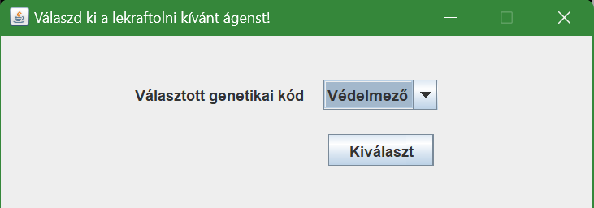
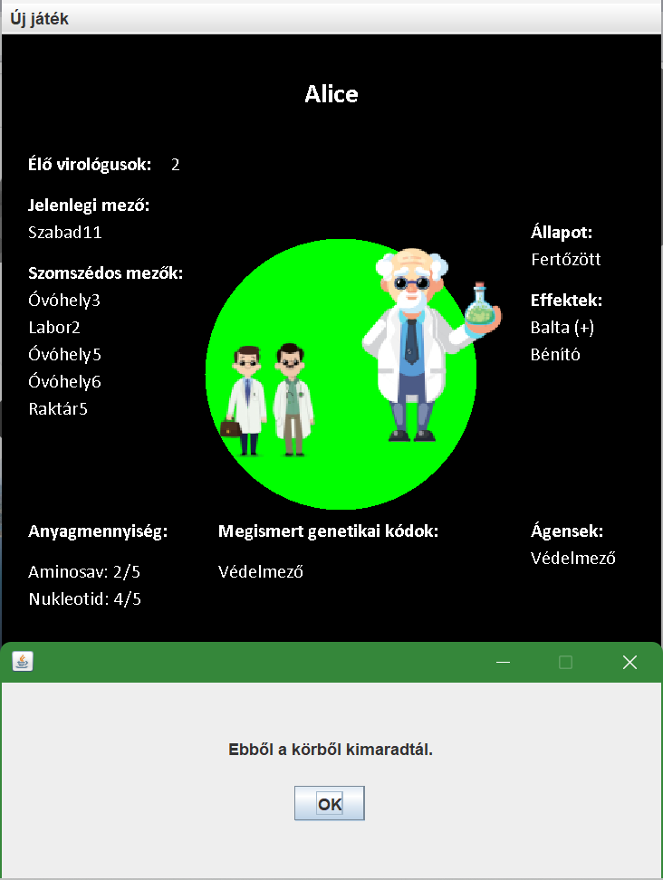
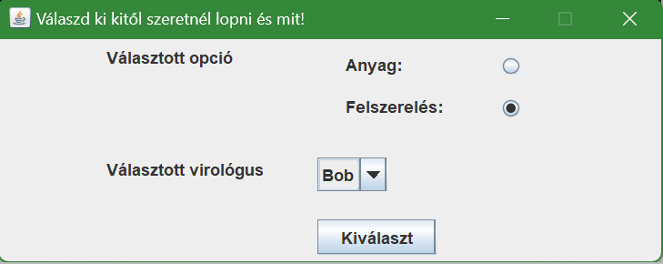

#Manual Testing

---
##**Teszteset neve**: *Új játék létrehozása*

**ID**: 1

**Teszteset leírása**:
A teszt ellenőrzi egy új játék létrehozását.

**Előfeltételek**:
- A program telepítve van és fut.

**Lépések**:
1. *Új játék* gombra kattintás.
2. *Létrehozása* gombra kattintás.

**Elvárt kimenet**: Új játék létrehozódott.

**Kimenet**: Siker.

**Megjegyzés**: -

---

##**Teszteset neve**: *Játékosok hozzáadása és játék indítása*

**ID**: 2

**Teszteset leírása**:
A teszt ellenőrzi 2 játékos hozzáadását, *Alice* és *Bob* néven, 
majd ellenőrzi a játék indítását.

**Előfeltételek**:
- A program telepítve van és fut.
- Az 1. teszteset sikeresen lefutott.

**Lépések**:
1. Játékos neve mezőbe "Alice" bevitele.
2. *Hozzáadás* gombra kattintás.
3. Játékos neve mezőbe "Bob" bevitele.
4. *Hozzáadás* gombra kattintás.
5. *Játék indítása* gombra való kattintás.

**Elvárt kimenet**: A két játékos Alice és Bob hozzáadódik a játékhoz,
az 5. lépés után elindul a játék.

**Kimenet**: Siker.

**Megjegyzés**: 
- Fejlesztési lehetőség: Ha a játékos neve nem üres, akkor
a hozzáadás gomb megnyomása nélkül, csak a játék indításával is hozzáadódik a játékos.

---

##**Teszteset neve**: *Játékos mozgatása Szabad mezőre*

**ID**: 3

**Teszteset leírása**:
A teszteset ellenőrzi *Alice* virológus mozgatását *Szabad* típusú mezőre.

**Előfeltételek**:
- A 2. teszteset sikeresen lefutott.
- Alice virológus a *Szabad15* mezőn áll.

**Lépések**:
1. A *"Válassz az alábbi cselekvések közül!"* ablakban a csizma,
mozgatás ikonra kattintás.

2. A *"Válaszd ki a célmezőt!"* ablakban a legördülő menüből a *Szabad16*
mező kiválasztása.

3. *Kiválaszt* gombra kattintás.

**Elvárt kimenet**: *Alice* virológusa átmozog a *Szabad16* mezőre, majd Bob játékos következik. 
*Bob* körének végeztével ellenőrizhető a kimenet: a *Jelenlegi mező* értéke *Szabad16*.

**Kimenet**: Siker.

**Megjegyzés**: -

---

##**Teszteset neve**: *Játékos mozgatása óvóhely mezőre, ott eszköz felvétele*

**ID**: 4

**Teszteset leírása**: 
A teszteset ellenőrzi *Bob* virológus mozgatását *Óvóhely* típusú mezőre és ott
az automatikus eszközfelvételt.

**Előfeltételek**:
- *Bob* játékos következik.
- *Bob* játékos a *Szabad11* mezőn áll.

**Lépések**:
1. A *"Válassz az alábbi cselekvések közül!"* ablakban a csizma,
   mozgatás ikonra kattintás.

2. A *"Válaszd ki a célmezőt!"* ablakban a legördülő menüből az *Óvóhely3*
   mező kiválasztása.

3. A *Kiválaszt* gombra kattintás.

**Elvárt kimenet**: Bob virológus átmozog az *Óvóhely3* mezőre, ott az 
*Effektekhez* felkerül a *Zsák* majd Alice játékos
következik.

**Kimenet**: Sikeres. 

**Megjegyzés**: -

---

##**Teszteset neve**: *Játékos mozgatása Raktár mezőre, ott anyagmennyiség gyűjtése*

**ID**: 5

**Teszteset leírása**: A teszt ellenőrzi *Bob* virológus mozgatását *Raktár* típusú
mezőre, aki ott automatikusan anyagmennyiséget gyűjt.

**Előfeltételek**:
- *Bob* játékos következik.
- *Bob* játékos az *Óvóhely3* mezőn áll.

**Lépések**:
1. A *"Válassz az alábbi cselekvések közül!"* ablakban a csizma,
   mozgatás ikonra kattintás.

2. A *"Válaszd ki a célmezőt!"* ablakban a legördülő menüből a *Raktár2*
   mező kiválasztása.

3. A *Kiválaszt* gombra kattintás.

**Elvárt kimenet**: Bob virológus átmozog a *Raktár2* mezőre,
ott anyagmennyiséget gyűjtött (+3 Aminosav, +3 Nukleotid). *Alice* játékos
köre után ellenőrizhető a kimenet: az anyagmennyiség aminosav és nukleotid értéke 
emelkedett 3-mal, valamint a *Jelenlegi mező* értéke *Raktár2*.

**Kimenet**: Sikeres.

**Megjegyzés**: -

---

##**Teszteset neve**: *Játékos mozgatása Labor mezőre, ott genetikai kód letapogatása*

**ID**: 6

**Teszteset leírása**: A teszteset ellenőrzi Alice játékos *Labor* mezőre
mozgatását, ott automatikusan a genetikai kód letapogatását.

**Előfeltételek**:
- Alice játékos következik.
- Alice játkos a *Szabad11* mezőn áll.

**Lépések**:
1. A *"Válassz az alábbi cselekvések közül!"* ablakban a csizma,
mozgatás ikonra kattintás.

2. A *"Válaszd ki a célmezőt!"* ablakban a legördülő menüből a *Labor2*
   mező kiválasztása.

3. A *Kiválaszt* gombra kattintás.

**Elvárt kimenet**: Alice játkos átmozgott a *Labor2* mezőre, ott automatikusan
letapogatja a *védelmező* genetikus kódot. A megtanult genetikus kód bekerül a *Megismert genetikai kódok*
közé.

**Kimenet**: Sikeres.

**Megjegyzés**: -

---

##**Teszteset neve**: *Védelmező ágens készítése sikeres*

**ID**: 7

**Teszteset leírása**: A teszteset ellenőrzi a *védelmező* ágens sikeres elkészítését.

**Előfeltételek**:
- A 6. teszteset sikeresen lefutott.
- Alice játékos következik.
- Alice aminosav készlete legalább 2/5.

**Lépések**:
1. A *"Válassz az alábbi cselekvések közül"* ablakon a lombik, ágens
készítő ikonra való kattintás.

2. A *"Válaszd ki a lekraftolni kívánt ágenst"* ablakon a legördülő
sávból a *védelmező* ágens kiválasztása.

3. A *Kiválaszt* gombra kattintás.

**Elvárt kimenet**: *Alice* ágensei között megjelenik a *Védelmező* ágens, anyagmennyiségénél
az Aminosav értéke 2-vel csökkent, valamint a *Válassz az alábbi cselekvések közül* ablakban
már kattinthatóvá válik az injekciós tű gombja. *Bob* játékos köre után ellenőrizhtő a kimenet.

**Kimenet**: Sikeres.

**Megjegyzés**: -

---

##**Teszteset neve**: *Játékos mozgatása Labor mezőre, ott megfertőződés medvevírussal*

**ID**: 8

**Teszteset leírása**: A teszteset ellnőrzi, ahogy *Bob* játékos *Labor* mezőre lép, 
ott megfertőződik medvevírussal.

**Előfeltételek**:
- *Bob* játékos következik.
- *Bob* játékos *Szabad3* mezőn áll.

**Lépések**:
1. A *"Válassz az alábbi cselekvések közül!"* ablakban a csizma,
   mozgatás ikonra kattintás.

2. A *"Válaszd ki a célmezőt!"* ablakban a legördülő menüből a *Labor3*
   mező kiválasztása.

3. A *Kiválaszt* gombra kattintás.

**Elvárt kimenet**: Bob játékos átmozog a *Labor3* mezőre, ahol automatikusan megfertőződik a medvevírussal. (Állapot: fertőzött, Effektek: medvevírus)
Bob a következőkben már nem képes önálló mozgásra, a felugró ablakban az "Ebből a körből kimaradtál" felirat jelenik meg.
A további körökben Bob mozgása véletlenszerű.

**Kimenet**: Sikeres.

**Megjegyzés**: -

---

##**Teszteset neve**: *Védelmező ágens használata önmagán*

**ID**: 9

**Teszteset leírása**: A teszeset ellenőrzi a *védelmező ágens*
használatát a játékoson.

**Előfeltételek**:
- A 7. teszteset sikeresen lefutott.
- Alice játékos következik.

**Lépések**:
1. A *"Válassz az alábbi cselekmények közül"* ablakban az injekciós tűre,
ágens használatának gombjára kattintás.

2. A felugró ablakban a *Választott ágens*-nél a *Védelmező* ágens kiválasztása,
a *Választott virológus* legördülő sávban *Alice* kiválasztása.

3. A *Kiválaszt* gombra kattintás.

**Elvárt kimenet**: Alice virológusnál az *Effektek* közé felkerült a *Védelmező* effekt, 
az ágensek közül pedig eltávolítódott egy *Védelmező* ágens.

**Kimenet**: Sikeres.

**Megjegyzés**: -

---

##**Teszteset neve**: Védelmező ágens készítése sikertelen**

**ID**: 10

**Teszteset leírása**: A teszteset ellenőrzi a *védelmező* ágens
elkészítésének sikertelenségét.

**Előfeltételek**:
- A 6. teszteset sikeresen lefutott, 
- *Alice* virológus *Aminosav szintje* 2-nél kevesebb.

**Lépések**:
1. A *"Válassz az alábbi cselekvések közül"* ablakon a lombik, ágens készítése ikonra kattintás.
[img.png](test10_1.png)
2. A *"Választott genetikai kód"* legördülő menüjében a *Védelmező* kiválasztása.

3. A *Kiválaszt* gombra kattintás.

**Elvárt kimenet**: *Bob* körének végeztével *Alice* *Ágensei* között nem jelenik meg az elkészített
*Védelmező* ágens, *Aminosav* értéke nem csökken.

**Kimenet**: Sikeres.

**Megjegyzés**: -

---

##**Teszteset neve**: *Bénító ágens használata másik virológuson*

**ID**: 11

**Teszteset leírása**: A teszteset ellenőrzi *Bénító* használatát
egy másik virológuson.

**Előfeltételek**: 
- *Bob* és *Alice* egy mezőn állnak.
- *Bob* ágensei között szerepel a *Bénító*.

**Lépések**: 
1.A *"Válassz az alábbi cselekvések közül"* az injekciós tű, ágens használata gombra kattintás. 

2. A *"Választott ágens"* legördülő menüjéből a *Bénító* kiválasztása. 

3. A *"Választott virológus"* legördülő menüjéből *Alice* virológus kiválasztása.
4. A *Kiválaszt* gombra kattintás.

**Elvárt kimenet**: *Alice* virológus képtelen a cselekvésre, mozgásra 2 körön át. Az *Ok* gomb megnyomására újra *Bob* játékos következik.

**Kimenet**: Sikeres.

**Megjegyzés**: -

---

##**Teszteset neve**: *Anyag lopásának sikeressége*

**ID**: 12

**Teszteset leírása**: A teszteset ellenőrzi a lop

**Előfeltételek**:
- *Bob* és *Alice* egy mezőn állnak.
- *Bob*-nak van elegendő anyagmennyisége.
- *ALice* következik.

**Lépések**:
1. A *"Válassz az alábbi cselekvések közül"* ablakban a zsák, lopás ikonra való kattintás. 

2. A *"Választott opció"*-nál anyag kiválasztása. 

3. A *"Választott virológus"* legördülő menüből *Bob* kiválasztása.
4. A *Kiválaszt* gombra való kattintás.

**Elvárt kimenet**: *Bob* virológus anyagmennyisége csökkent 1-1 mennyiséggel, *Bob* körének befejeztével pedig ellnőrizhető,
hogy *Alice* anyagmennyisége nőtt 1-1 mennyiséggel.

**Kimenet**: Sikeres.

**Megjegyzés**: -

---

##**Teszteset neve**: *Anyagmennyiség maximum kapacitásának elérése*

**ID**: 13 

**Teszteset leírása**: A teszteset ellenőrzi, hogy az anyagmennyiség maximális szintjének elérésekor újra *Raktár*
típusú mezőre lépve már nem növekedik az anyagmennyiség.

**Előfeltételek**:
- *Alice* virológus elérte a maximum anyagmennyiségét.
- *Alice* virológus a *Raktár4* mezőn áll.
**Lépések**:
1. *Alice* virológus a 3. teszteset lépéseit követve a *Szabad15* mezőre navigál.
2. *Bob* körének befejeztével *Alice* virológus visszanavigál a *Raktár4* mezőre.

**Elvárt kimenet**: *Alice* virológus anyagmennyisége a maximumot elérve, valamint újra *Raktár* típusú mezőre érkezve már nem növekszik.

**Kimenet**: Sikeres.

**Megjegyzés**: -

---

##**Teszteset neve**: *Védelmező ágens használatával Bénító támadás kivédése*

**ID**: 14

**Teszteset leírása**: A teszteset ellenőrzi a *Védelmező* ágens védelmi funkcióját a *Bénító* ágenssel való támadás ellen.

**Előfeltételek**:
- *Bob* és *Alice* ugyanazon a mezőn állnak.
- *Bob* rendelkezik *Védelmező* ágenssel.
- *Alice* rendlekezik *Bénító* ágenssel.

**Lépések**:
1. *Bob* virológus felhasználja saját magán a *Védelmező* ágenst a 9. teszteset lépéseit követve. 
2. *Alice* virológus *Bob* virológusra keni az elkészített *Bénító* ágenst a 11. teszteset lépéseit követve. 

**Elvárt kimenet**: A két virológus képes a mozgásra és cselekvésre is, a két ágens semlegesíti egymást, újra *Bob* következik. 

**Kimenet**: Sikeres. 

**Megjegyzés**: -

---

##**Teszteset neve**: *Eszközlopás sikeressége*

**ID**: 15

**Teszteset leírása**: A teszteset elolenőrzi az eszközlopást egy másik játékostól.

**Előfeltételek**:
- *Alice* és *Bob* egy mezőn helyezkednek el.
- *Alice* rendelkezik legalább egy eszközzel.
- *Bob* következik.
- *Bob* rendelkezik *Bénító* ágenssel.

**Lépések**:
1. A *"Válassz az alábbi cselekvések közül" az *injekciós tű* kiválasztása.
2. A *Választott ágens* legördülő menüjéből a *Bénító* kiválasztása, a *Választott virológus*
legördülő menüjéből *Alice* virológus kiválasztása.

3. *Alice* virológus körében az *Ok* gombra kattintás.

4. A *"Válassz az alábbi cselekvések közül"* a zsák, lopás ikonra való kattintás.

5. A *"Választott opció"*-nál a *felszerelés* kiválasztása, a *"Választott virológus"* legördülő menüjéből *Alice*
játékos kiválasztása.

6. A *Kiválaszt* gombra kattintás.

**Elvárt kimenet**: *Bob* virológus effektjei közé felkerül a Balta (+) effekt.

**Kimenet**:Sikeres.

**Megjegyzés**: -

---

##**Teszteset neve**: *Vitustánc működése*

**ID**: 16

**Teszteset leírása**: A teszteset ellenőrzi, hogy *Vitustánc* használata után a játékos mozgása véletlenszerű.

**Előfeltételek**:
- *Alice* és *Bob* egy mezőn tartózkodnak.
- *Bob* rendelkezik elkészített *Vitustánc* ágenssel.
- *Bob* virológus következik.

**Lépések**:
1. A *"Válassz az alábbi cselekvések közül"* az injekciós tű, ágens használata gombra kattintás.

2. A *"Választott ágens"* legördülő menüből a *Vitustánc* kiválasztása, a *Választott virológus* legördülő menüből *Alice* játékos kiválasztása.

3. A *Kiválaszt* gombra kattintás.

**Elvárt kimenet**: *Alice* játékos véletlenszerű pályán mozog, 2 körön át az *Ebből a körből kimaradtál* felirat látható.

**Kimenet**: Sikeres.

**Megjegyzés**: -

---

##**Teszteset neve**: *Balta használata másik játékoson*

**ID**: 17

**Teszteset leírása**: A teszteset ellenőrzi a *Balta* használatát egy másik játékoson.

**Előfeltételek**:
- *Bob* játékos rendelkezik *Baltával*.
- *Bob* és *Alice* egy mezőn tartózkodnak.
- *Bob virológus következik.*

**Lépések**:
1. A *"Válassz az alábbi cselekvések közül"* a *Balta* ikonra való kattintás.

2. A *Választott virológus* legördülő menüből *Alice* virológus kiválasztása.ű

3. A *Kiválaszt* gombra kattinás.

**Elvárt kimenet**: *Alice* virológus már nem tud a cselekvések közül választani, újra *Bob*
virológus következik, valamint az *Élő virológusok* száma csökkent eggyel.

**Kimenet**: Sikeres.

**Megjegyzés**: -

---

##**Teszteset neve**: *Kesztyű használata védekezéshez*

**ID**: 18 

**Teszteset leírása**: A teszteset ellenőrzi a kesztyű működését támadás esetén.

**Előfeltételek**:
- *Bob* és *Alice* egy mezőn tartózkodnak.
- *Bob* virológus rendelkezik egy kesztyűvel.
- *Alice* virológus rendelkezik egy *Vitustánc* ágenssel.
- *Alice* virológus következik.

**Lépések**:
1. A *"Válassz az alábbi cselekvések közül"* az injekciós tű kiválasztása.

2. A *Választott ágens* legördülő menüjéből a *Vitustánc*, a *Választott játékos*
legördülő menüjéből *Bob* virológus kiválasztása.

3. A *Kiválaszt* gombra kattintás.

**Elvárt kimenet**: Bob játékos következik, a *Kesztyű* számlálója csökkent eggyel, majd a körének befejeztével
*Alice* következik, akinek effektjei közé felkerült a *Vitustánc*.

**Kimenet**: Sikeres.

**Megjegyzés**: -

---

##**Teszteset neve**: *Zsák működésének ellenőrzése*

**ID**: 19

**Teszteset leírása**: A teszteset ellenőrzi a *zsák* működését.

**Előfeltételek**:
- *Bob* a *Szabad19* mezőn áll.
- *Bob* következik.
 
**Lépések**:
1. A *"Válassz az alábbi lehetőségek közül"* a *csizma*, mozgás ikonra való kattintás.

2. A *"Választott mező"* legördülő menüből az *Óvóhely7* kiválasztása.

3. A *Kiválaszt* gombra kattintás.

**Elvárt kimenet**: *Alice* körének befejeztével ellenőrizhető, hogy az alap enyagmennyiség 
5-ről 7-re emelkedett, valamint az effektek közé felkerült a *Zsák*.

**Kimenet**: Sikeres.

**Megjegyzés**: -

---

##**Teszteset neve**: *A Bénító ágens megtanulása*

**ID**: 20

**Teszteset leírása**: A teszteset ellenőrzi a *bénító* ágens megtanulását.

**Előfeltételek**:
- *Bob* az *Raktár6* mezőn áll.
- *Bob* következik.

**Lépések**:
1. A *"Válassz az alábbi lehetőségek közül"* a *csizma*, mozgás ikonra való kattintás.

2. A *"Választott mező"* legördülő menüből az *Labor5* kiválasztása.

3. A *Kiválaszt* gombra kattintás.

**Elvárt kimenet**: *Alice* körének befejeztével ellenőrizhető, hogy *Bob* genetikai kódjai közé
felkerült a *Bénító ágens*.

**Kimenet**: Sikeres.

**Megjegyzés**: -

78%-a foglalt a tárhelyednek … Amikor mented fájljaidat a Drive-ra, biztonsági mentés készítesz a Google Fotókba, illetve e-mailt küldesz és fogadsz a Gmailben, tárhelyet használsz fel
tesztek.txt
---

##**Teszteset neve**: *Köpeny felvétele*

**ID**: 21

**Teszteset leírása**: A teszteset ellenőrzi a *köpeny* felvételét.

**Előfeltételek**:
- *Alice* a *Szabad1* mezőn áll.
- *Alice* következik.

**Lépések**:
1. A *"Válassz az alábbi lehetőségek közül"* a *csizma*, mozgás ikonra való kattintás.
   
2. A *"Választott mező"* legördülő menüből az *Óvóhely2* kiválasztása.
   
3. A *Kiválaszt* gombra kattintás.

**Elvárt kimenet**: *Bob* körének befejeztével ellnőrizhető, hogy *Alice* effektjei közé felkerült a *Köpeny*.

**Kimenet**: Sikeres.

**Megjegyzés**: -

---

##**Teszteset neve**: *Köpeny működésének tesztelése*

**ID**: 22

**Teszteset leírása**: A teszteset ellenőrzi a *köpeny* működését.

**Előfeltételek**:
- *Alice* és *Bob* a ugyanazon a mezőn áll.
- *Bob* rendelkezik elkészített *bénító* ágenssel.
- *Alice* rendelkezik *köpennyel*.
- *Bob* következik.

**Lépések**:
1. A *"Válassz az alábbi lehetőségek közül"* a *tű*, ágens használata ikonra való kattintás.
   
2. A *"Választott ágens"* legördülő menüből a *Bénító*, a *"Választott virológus"* legördülő menüből *Alice* kiválasztása.
   
3. A *Kiválaszt* gombra kattintás.

**Elvárt kimenet**: *Alice* a körében ellnőrizhető, hogy a játékos képes minden interakcióra, amire eddig, tehát az ágens felkenése sikertelen volt.

**Kimenet**: Sikeres.

**Megjegyzés**: -

---

##**Teszteset neve**: *Köpeny működésének tesztelése, ha a támadó ágens medvevírus*

**ID**: 23

**Teszteset leírása**: A teszteset ellenőrzi a *köpeny* működését, abban az esetben, ha a játékos olyan mezőre lép, ahol megfertőződik medvevírussal, vagy találkozik olyan játékossal, aki megfertőződött.

**Előfeltételek**:
- *Alice* rendelkezik *köpennyel*.
- *Alice* a *Szabad3* mezőn áll.

**Lépések**:
1. A *"Válassz az alábbi lehetőségek közül"* a *csizma*, mozgás ikonra való kattintás.
   
2. A *"Választott mező"* legördülő menüből a *Labor3* kiválasztása.
   
3. A *Kiválaszt* gombra kattintás.

**Elvárt kimenet**: *Alice* a körében ellnőrizhető, hogy a játékos képes minden interakcióra, amire eddig, tehát az medveágenssel való megfetőződés sikertelen volt.

**Kimenet**: Sikeres.

**Megjegyzés**: -

---

##**Teszteset neve**: *Bénító ágens készítése sikeres*

**ID**: 24

**Teszteset leírása**: A teszteset ellenőrzi a *Bénító* ágens készítését.

**Előfeltételek**:
- *Bob* ismeri *Bénító* genetikai kódot.
- *Bob* rendelkezik elegendő anyagmennyiséggel.

**Lépések**:
1. A *"Válassz az alábbi lehetőségek közül"* a *lombik*, ágens készítése ikonra való kattintás.
   
2. A *"Választott genetikai kód"* legördülő menüből a *Bénító* kiválasztása.
   
3. A *Kiválaszt* gombra kattintás.

**Elvárt kimenet**: *Alice* körének befejeztével ellenőrizhteő, hogy az ágens készítés sikeres volt, *Bob* virológus ágensei közé felkerült a *Bénító*. 

**Kimenet**: Sikeres.
   
**Megjegyzés**: -

---

##**Teszteset neve**: *Vitustánc ágens ágens készítése sikeres*

**ID**: 25

**Teszteset leírása**: A teszteset ellenőrzi a *Vitustánc* ágens készítését.

**Előfeltételek**:
- *Alice* ismeri *Vitustánc* genetikai kódot.
- *Alice* rendelkezik elegendő anyagmennyiséggel.

**Lépések**:
1. A *"Válassz az alábbi lehetőségek közül"* a *lombik*, ágens készítése ikonra való kattintás.
   
2. A *"Választott genetikai kód"* legördülő menüből a *Vitustánc* kiválasztása.
   
3. A *Kiválaszt* gombra kattintás.

**Elvárt kimenet**: *Bob* körének befejeztével ellenőrizhető, hogy az ágens készítés sikeres volt, *Alice* virológus ágensei közé felkerült a *Vitustánc*.

**Kimenet**: Sikeres.
   

**Megjegyzés**: -

---

